# 校园论坛和资源共享小程序
Gitee项目地址：[https://gitee.com/Kevin_Hunter/easyShare](https://gitee.com/Kevin_Hunter/easyShare)

CSDN博客地址：[https://blog.csdn.net/Hunter_Kevin/article/details/125240533?spm=1001.2014.3001.5502](https://blog.csdn.net/Hunter_Kevin/article/details/125240533?spm=1001.2014.3001.5502)

## 一、介绍
1. 微信小程序，论坛小程序，BBS小程序，文件上传下载小程序。
2. 毕业设计小程序有前后端完整源码和数据库，注释详细，易于二次开发。
3. 个人资质小程序，也可用于企业开发，页面做了技术处理，个人资质也可轻松通过微信平台审核上线小程序。
4. 原生语法，后端基于微信云开发，部署简单，免服务器和域名备案。
5. 使用CMS平台进行数据库表及数据管理，轻松便捷易拓展

## 二、软件架构
此校园社区平台小程序像一个校园论坛，资源分享平台，它的核心功能是分享。系统角色主要细分为三类：高级管理员、普通管理员、普通用户。系统中不同的角色具备不同的系统权限。帖子内容浏览、帖子发布、资源发布、资源下载、我的数据管理等功能是每个普通用户以及管理员所共有的，但不同角色对数据的操作权限不同。简单来说，可以将所有角色看成小程序用户，但是角色之间的区别在于高级管理员、普通管理员以及用户对数据的操作权限逐级递减。

用户登录小程序之后可以进入发布页面动态发布包含图片、视频的帖子或者文档资源，其他小程序用户可以对帖子进行搜索、评论、点赞、收藏、分享等操作，用户还可以下载小程序中的资源文件到本地。管理员能够对用户上传的帖子、评论、资源的内容进行审核，审核通过后用户才可以访问，并且高级管理员可以控制小程序运行相关的后台参数，对关键性数据进行处理。

## 三、功能简介图


## 四、数据库实体E-R图


## 五、已上线小程序二维码


## 六、安装教程
### 1、小程序开发环境配置
小程序后台地址： https://mp.weixin.qq.com/

（1）提前下载安装好微信开发者工具，选择“创建小程序”，点击填写“APPID”栏右侧的注册，在弹出的网页中填写必要信息申请一个小程序，小程序注册完成后会获得该小程序一个专属的APPID。

（2）在“创建小程序”中填写“项目名”、“目录”、“APPID”。注意在“后端服务”栏中选择“不使用云服务”，最后点击右下角的“确定”。

（3）项目创建成功后，点击窗口左上角的“云开发”按钮打开“云开发控制台”，开始初始化云服务。

（4）云服务初始化完成后，点击“云开发控制台”右上角的“设置”按钮，填写云环境名称，选择“按量付费”，云环境的创建和初始化过程一般需要几分钟的时间。

（5）点击“云开发控制台”顶部栏的“更多”按钮，点击“内容管理”，创建并初始化当前小程序云数据库对应的cms内容管理，这一过程也需要等待几分钟。

### 2、在cms内容管理中导入数据库集合
`需要导入的数据集文件：`


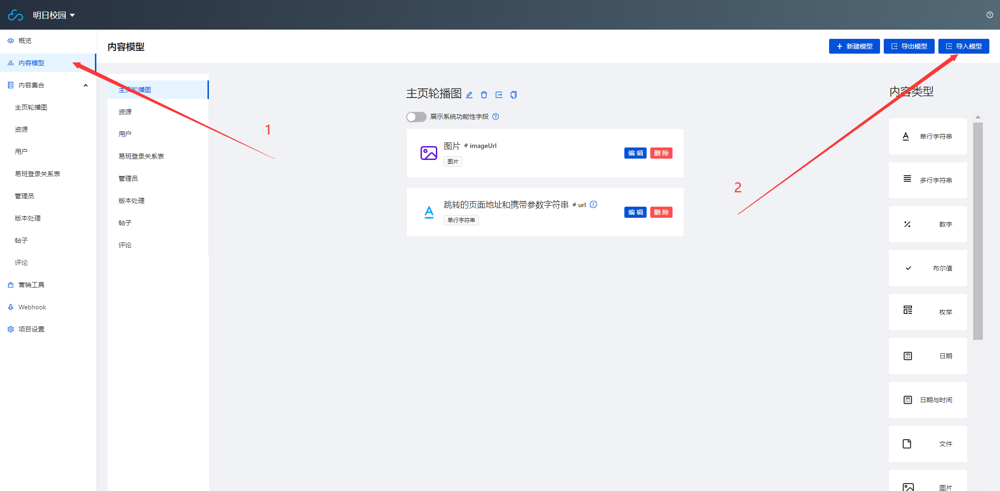
### 3、在`版本处理表`中新建一条数据
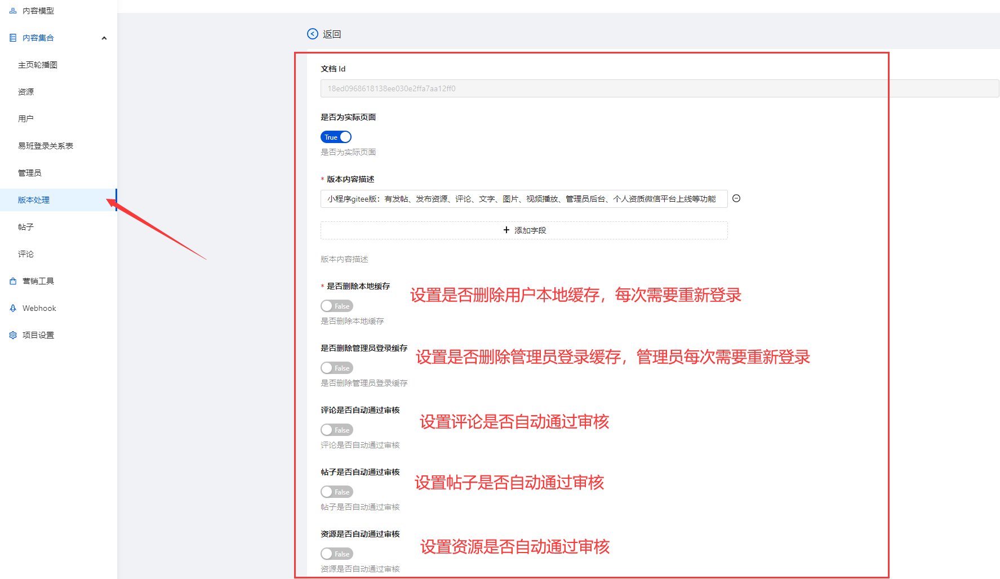
### 4、在小程序后台添加合法域名

`需要添加的域名：https://thirdwx.qlogo.cn`

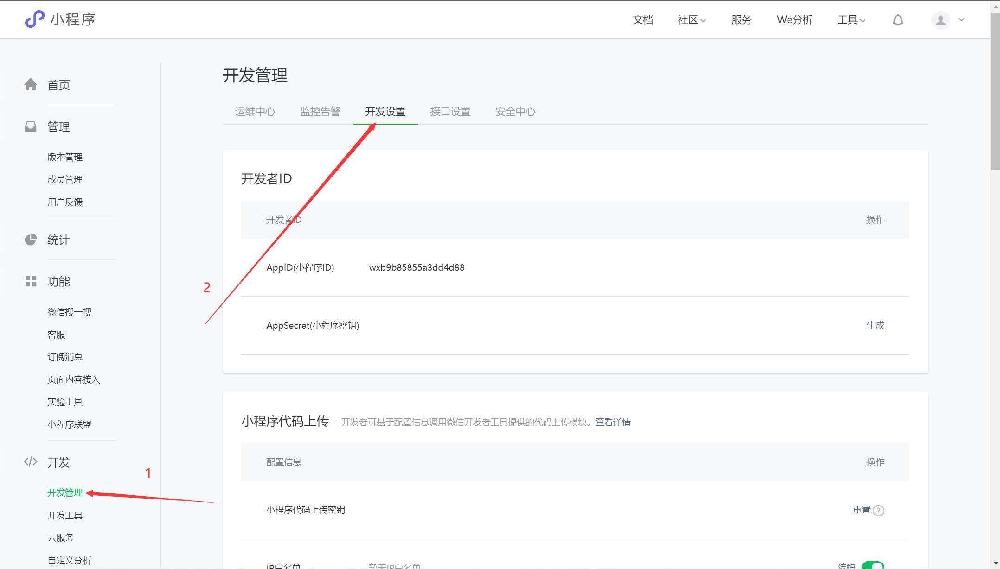

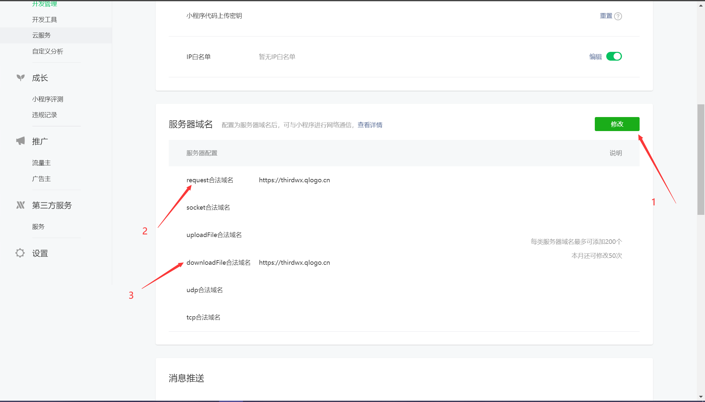

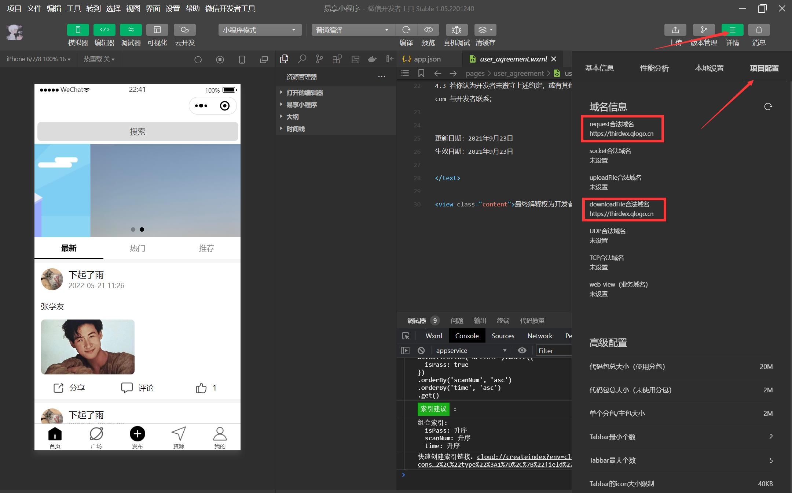
### 5、设置数据库表的修改权限
`将前面7个数据库表的数据权限修改成如下：`

```json
{
  "read": true,
  "write":  true,
}
```

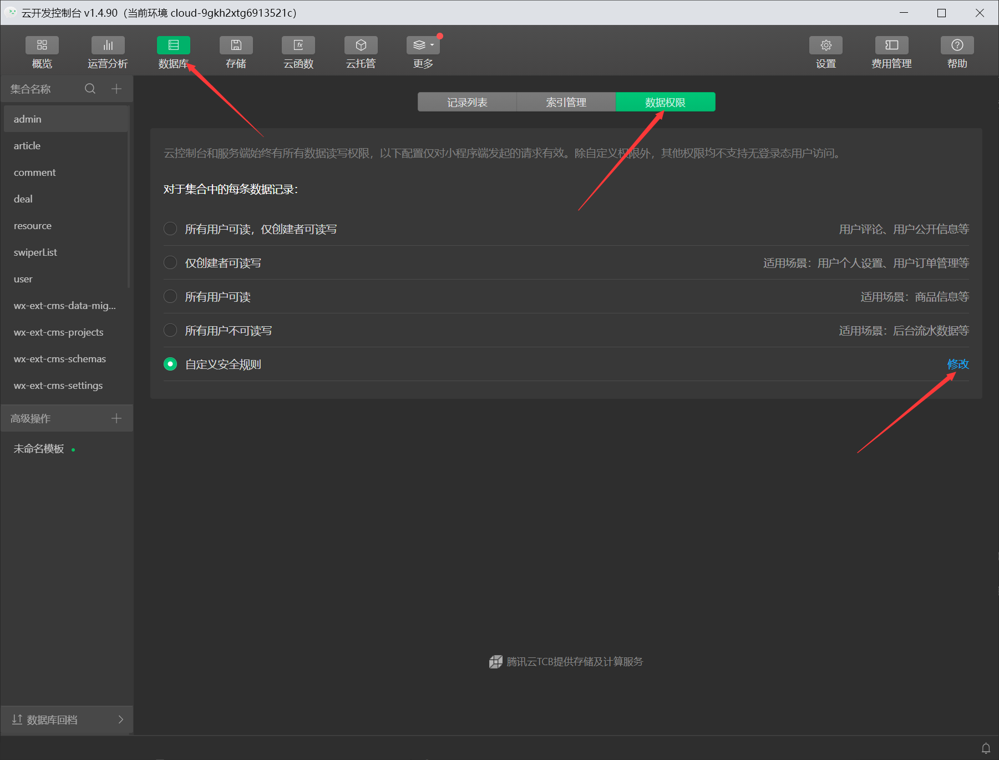

### 6、修改app.js中的初始化云环境
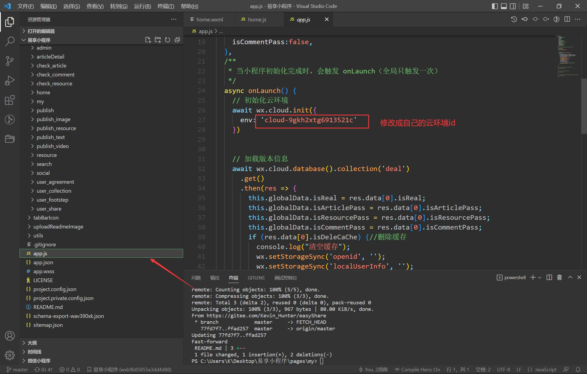

### 7、至此，小程序可以正常运行

### 8、添加管理员账号，管理小程序
#### 8.1、 添加账号
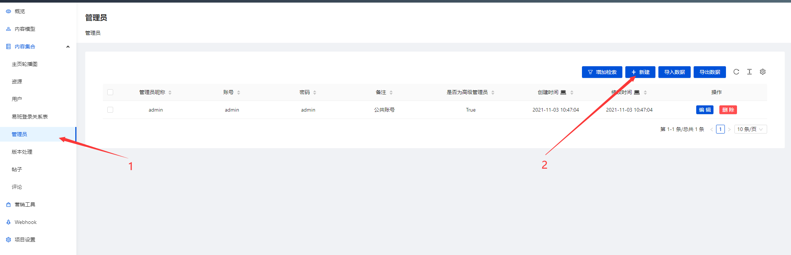

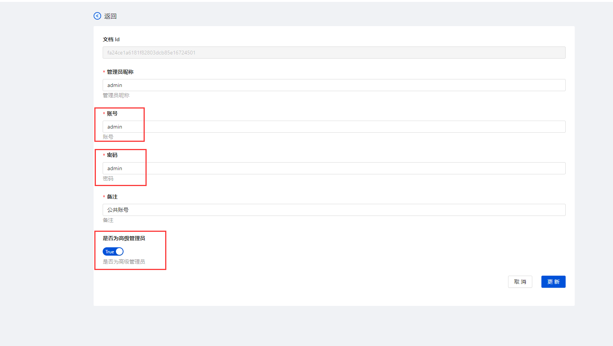
#### 8.2、进入后台管理小程序
进入`我的`页面，点击`切换身份`按钮，输入管理员的账号，密码，即可进入管理界面

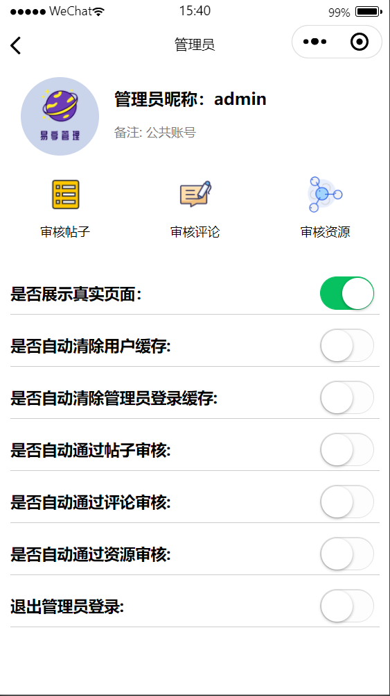

### 9、小程序上线相关
#### 9.1、在提交为体验版之前删掉一些无用的文件

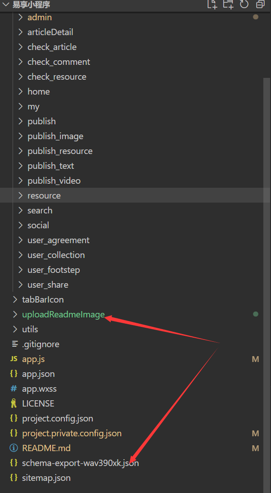

#### 9.2、将体验版提交上线审核之前修改为假页面
1.在将体验版提交上线审核之前，先在小程序端上传任意几条资源文件数据，作为假页面展示的内容

2.在管理员后台页面修改`是否展示真实页面`按钮为`false`

3.将体验版小程序申请审核为正式版，等待微信平台审核通过后再修改`是否展示真实页面`按钮为`true`。此后每次提交上线审核操作都是如此

## 七、tip
联系方式：
*   QQ：`1710102790`
*   wx：
    * 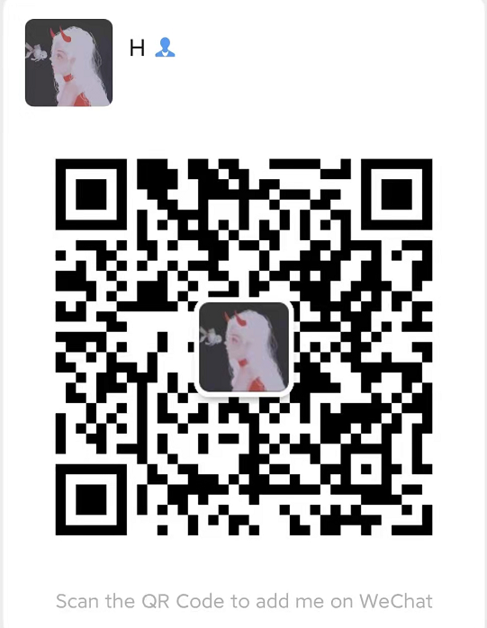
*   此项目于21年8月开始，至21年10月左右结束开发，代码相对有些冗余，暂未进行重构，但配有详细的注释，主要用于参加比赛，之后用于毕业设计，目前已通过完整的答辩流程，所在直到现在才开源
*   可协助搭建环境，技术交流，提供本小程序对应原型图文件、毕业设计论文初稿、终稿及相关程序流程图等系列相关资料