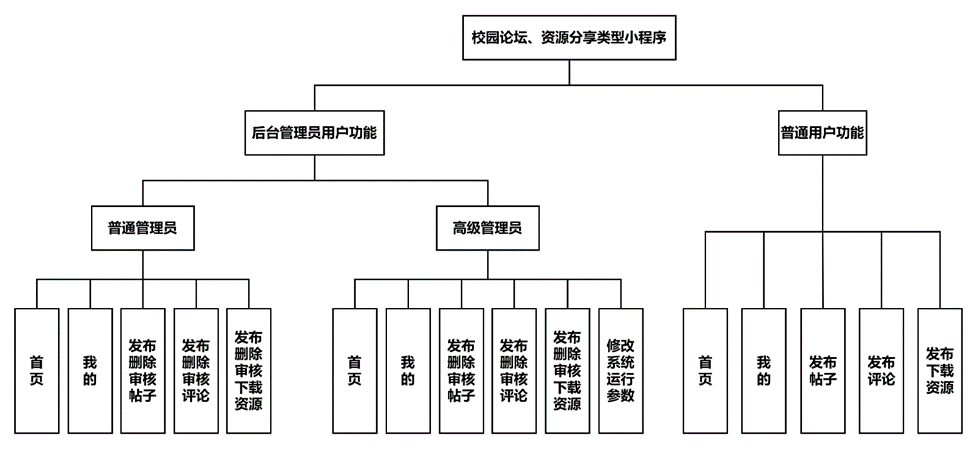
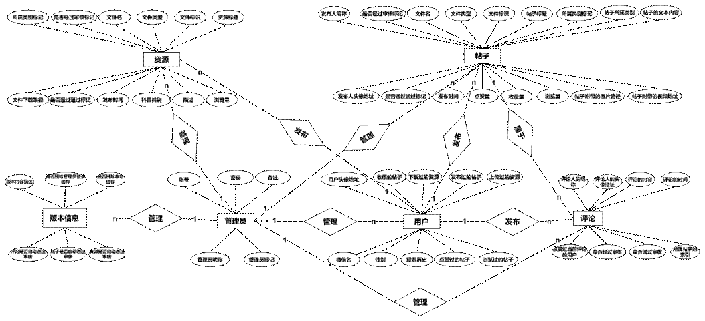

# 校园论坛和资源共享小程序

## 介绍
1. 微信小程序，论坛小程序，BBS小程序，文件上传下载小程序。
2. 毕业设计小程序有前后端完整源码和数据库，注释详细，易于二次开发。
3. 个人资质小程序，也可用于企业开发，页面做了技术处理，个人资质也可轻松通过微信平台审核上线小程序。
4. 原生语法，后端基于微信云开发，部署简单，免服务器和域名备案。
5. 使用CMS平台进行数据库表及数据管理，轻松便捷易拓展

#### 软件架构
此校园社区平台小程序像一个校园论坛，资源分享平台，它的核心功能是分享。系统角色主要细分为三类：高级管理员、普通管理员、普通用户。系统中不同的角色具备不同的系统权限。帖子内容浏览、帖子发布、资源发布、资源下载、我的数据管理等功能是每个普通用户以及管理员所共有的，但不同角色对数据的操作权限不同。简单来说，可以将所有角色看成小程序用户，但是角色之间的区别在于高级管理员、普通管理员以及用户对数据的操作权限逐级递减。

用户登录小程序之后可以进入发布页面动态发布包含图片、视频的帖子或者文档资源，其他小程序用户可以对帖子进行搜索、评论、点赞、收藏、分享等操作，用户还可以下载小程序中的资源文件到本地。管理员能够对用户上传的帖子、评论、资源的内容进行审核，审核通过后用户才可以访问，并且高级管理员可以控制小程序运行相关的后台参数，对关键性数据进行处理。

### 功能简介图

## 数据库实体E-R图

## 已上线小程序二维码

## 安装教程
待补充
1.  xxxx
2.  xxxx
3.  xxxx

## tip
联系方式：
*   QQ：`1710102790`
*   wx：`1710102790`
*   此项目于21年8月开始，至10月左右结束开发，代码相对有些冗余，暂未进行重构，但配有详细的注释，主要用于参加比赛,之后用于毕业设计，目前已通过完整的答辩流程，所在直到现在才开源
*   可协助搭建环境，技术交流，提供本小程序对应原型图文件、毕业设计论文初稿、终稿及相关程序流程图等系列相关资料